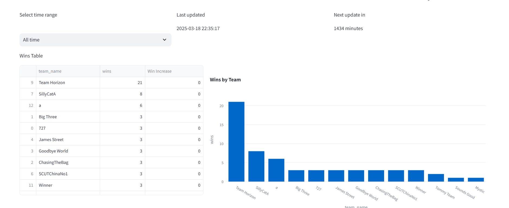
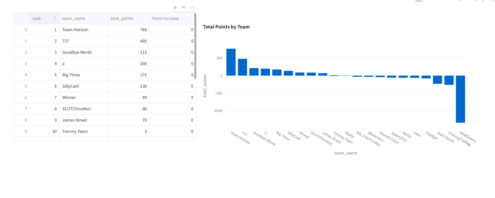

# Big2 AI Game Leaderboard 🃏

## Why This Exists
I created this leaderboard to keep track of how my Big2 AI bot was performing in the competition! My AI bot is based on a Monte Carlo approach and is hosted in [this repository](https://github.com/anurgyadv/Big2-AI-Monte-Carlo.git).

When you're competing in a bot tournament, it's super helpful to visualize performance data in real-time. This dashboard automatically fetches game logs every 20 minutes, processes them, and displays beautiful statistics so I can track my bot's progress against the competition.

## What It Does
This Streamlit dashboard shows:
- Real-time leaderboard rankings 📊
- Win counts for each team 🏆
- Point increases over time 📈
- Time-based filtering (All time, Last hour, Last 30 minutes) ⏱️

## Dashboard Screenshots



## Features
- Automatic data refresh every 20 minutes
- Interactive charts using Plotly
- Win tracking by team
- Point increase tracking
- Full game statistics

## The Tech Stack
- **Frontend**: Streamlit
- **Data Processing**: Pandas
- **Visualization**: Plotly
- **Data Collection**: Custom script that interfaces with the game server
- **Automatic Updates**: Git integration for version tracking

## Workflow
```
Login & Authentication → Download Game Logs → Extract ZIP Files → Process Log Data → Update Database → Visualize in Dashboard
       |                         |                  |                    |                  |                |
       v                         v                  v                    v                  v                v
  requests.post           requests.get        zipfile.extract      regex & pandas      CSV Storage     Streamlit & Plotly
 (JWT token auth)        (download .zip)     (unpack logs)        (data analysis)    (data/processed)   (visualization)
```
Every 20 minutes, this entire process runs automatically to keep the dashboard up to date with the latest game results.

## About Big2
Big2 (also known as Deuces or Big Two) is a card game where the objective is to be the first to play all your cards. The game is played with a standard 52-card deck, and the ranking is 2 (highest), A, K, Q, J, 10, 9, 8, 7, 6, 5, 4, 3 (lowest).

My AI implementation uses Monte Carlo simulation to make intelligent decisions in the game!

## What I Learned
Building this dashboard and data pipeline taught me a bunch of cool technical skills:

### Web Interactions and API Usage
- How to programmatically login to websites using Python's `requests` library
- Creating and sending JSON payloads for authentication
- Working with JWT bearer tokens for authenticated API requests
- Downloading and extracting ZIP files automatically

### Data Processing
- Parsing and processing log files with regex
- Calculating complex game statistics like card combinations and rankings
- Using Pandas for data manipulation and aggregation
- Creating time-series data for tracking performance over time

### Web Development
- Building interactive dashboards with Streamlit
- Creating responsive data visualizations using Plotly
- Implementing automatic refresh and data update cycles
- Designing user-friendly filtering and time-range selection

### DevOps and Automation
- Using `subprocess` to manage Git operations from Python
- Implementing automated data update and publishing cycles
- Setting up error handling and retry mechanisms